# Layer 5: Architecture diagrams

Every diagram here is drawn from the actual code, not from a generic picture of Redis.
They are written in [Mermaid](https://mermaid.js.org/), which GitHub renders automatically.
If you are reading this in a plain text editor, paste a block into <https://mermaid.live> to see it.

Each diagram has three short notes under it:
- **Read it as**: how to read the picture.
- **Why it matters**: the design point it shows.
- **Code**: where to look.

Contents

1. [System context](#1-system-context)
2. [Layered architecture](#2-layered-architecture)
3. [Header dependency graph](#3-header-dependency-graph)
4. [Class diagram (server)](#4-class-diagram-server)
5. [What one key looks like in memory](#5-what-one-key-looks-like-in-memory)
6. [The event loop, one iteration](#6-the-event-loop-one-iteration)
7. [Startup sequence](#7-startup-sequence)
8. [One request, end to end](#8-one-request-end-to-end)
9. [Pipelining and split packets: the input buffer over time](#9-pipelining-and-split-packets-the-input-buffer-over-time)
10. [Parser decision flow](#10-parser-decision-flow)
11. [Command dispatch](#11-command-dispatch)
12. [Connection lifecycle (state machine)](#12-connection-lifecycle-state-machine)
13. [Slow reader: EPOLLOUT on and off](#13-slow-reader-epollout-on-and-off)
14. [Key lifecycle and expiry](#14-key-lifecycle-and-expiry)
15. [AOF write path and fsync timing](#15-aof-write-path-and-fsync-timing)
16. [AOF replay at startup](#16-aof-replay-at-startup)
17. [REWRITEAOF: atomic compaction](#17-rewriteaof-atomic-compaction)
18. [Graceful shutdown](#18-graceful-shutdown)
19. [Skip list with spans: a worked example](#19-skip-list-with-spans-a-worked-example)
20. [Sorted set = hash map + skip list](#20-sorted-set--hash-map--skip-list)
21. [Client architecture](#21-client-architecture)
22. [Build graph](#22-build-graph)
23. [Test map](#23-test-map)

---

## 1. System context

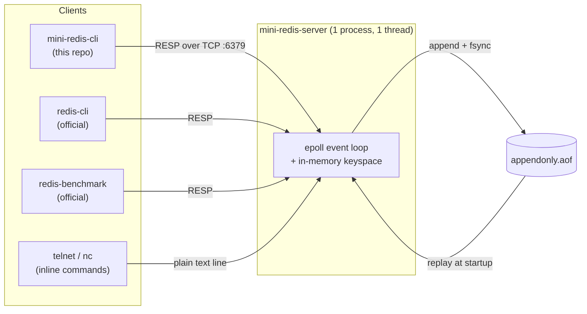
```mermaid
flowchart LR
    subgraph Clients
        CLI["mini-redis-cli<br/>(this repo)"]
        RCLI["redis-cli<br/>(official)"]
        RB["redis-benchmark<br/>(official)"]
        NC["telnet / nc<br/>(inline commands)"]
    end
    subgraph Server["mini-redis-server (1 process, 1 thread)"]
        S["epoll event loop<br/>+ in-memory keyspace"]
    end
    Disk[("appendonly.aof")]

    CLI -- "RESP over TCP :6379" --> S
    RCLI -- RESP --> S
    RB -- RESP --> S
    NC -- "plain text line" --> S
    S -- "append + fsync" --> Disk
    Disk -- "replay at startup" --> S
```

- **Read it as**: anything that speaks RESP can talk to the server. Only the server touches the disk.
- **Why it matters**: the official tools working unchanged is the proof that the protocol is implemented correctly. That is a strong, checkable claim.
- **Code**: `server/main.cpp`, `client/main.cpp`, `tests/e2e_test.sh` (the "compatibility with the official redis-cli" section).

---

## 2. Layered architecture

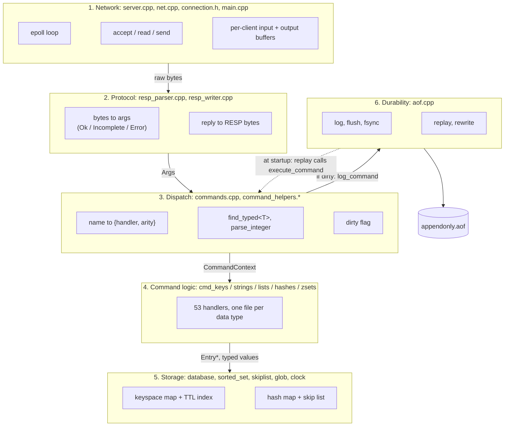
```mermaid
flowchart TB
    subgraph L1["1. Network: server.cpp, net.cpp, connection.h, main.cpp"]
        direction LR
        n1["epoll loop"] ~~~ n2["accept / read / send"] ~~~ n3["per-client input + output buffers"]
    end
    subgraph L2["2. Protocol: resp_parser.cpp, resp_writer.cpp"]
        direction LR
        p1["bytes to args<br/>(Ok / Incomplete / Error)"] ~~~ p2["reply to RESP bytes"]
    end
    subgraph L3["3. Dispatch: commands.cpp, command_helpers.*"]
        direction LR
        d1["name to {handler, arity}"] ~~~ d2["find_typed&lt;T&gt;, parse_integer"] ~~~ d3["dirty flag"]
    end
    subgraph L4["4. Command logic: cmd_keys / strings / lists / hashes / zsets"]
        direction LR
        c1["53 handlers, one file per data type"]
    end
    subgraph L5["5. Storage: database, sorted_set, skiplist, glob, clock"]
        direction LR
        s1["keyspace map + TTL index"] ~~~ s2["hash map + skip list"]
    end
    subgraph L6["6. Durability: aof.cpp"]
        direction LR
        a1["log, flush, fsync"] ~~~ a2["replay, rewrite"]
    end
    disk[("appendonly.aof")]

    L1 -->|"raw bytes"| L2
    L2 -->|"Args"| L3
    L3 -->|"CommandContext"| L4
    L4 -->|"Entry*, typed values"| L5
    L3 -->|"if dirty: log_command"| L6
    L6 --> disk
    L6 -. "at startup: replay calls execute_command" .-> L3
```

- **Read it as**: arrows point from caller to callee. Each layer only calls the layer below it, with one deliberate exception: the dotted arrow. At startup, `load_aof` calls `execute_command` to replay the log.
- **Why it matters**: the storage layer knows nothing about sockets, and the commands know nothing about epoll. That is why the unit tests can call `execute_command()` directly with no network at all (`tests/test_commands.cpp`).
- **Code**: `docs/2-architecture.md` section 1 has the file map.

---

## 3. Header dependency graph

This is generated from the real `#include "..."` lines (system headers left out).

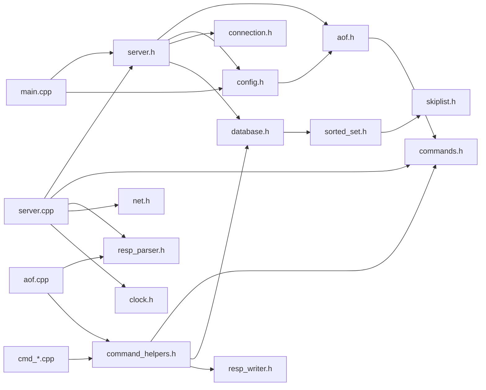
```mermaid
flowchart LR
    main_cpp["main.cpp"] --> server_h["server.h"]
    main_cpp --> config_h["config.h"]
    server_h --> aof_h["aof.h"]
    server_h --> config_h
    server_h --> connection_h["connection.h"]
    server_h --> database_h["database.h"]
    config_h --> aof_h
    aof_h --> commands_h["commands.h"]
    command_helpers_h["command_helpers.h"] --> commands_h
    command_helpers_h --> database_h
    command_helpers_h --> resp_writer_h["resp_writer.h"]
    database_h --> sorted_set_h["sorted_set.h"]
    sorted_set_h --> skiplist_h["skiplist.h"]
    server_cpp["server.cpp"] --> server_h
    server_cpp --> commands_h
    server_cpp --> resp_parser_h["resp_parser.h"]
    server_cpp --> net_h["net.h"]
    server_cpp --> clock_h["clock.h"]
    cmd_files["cmd_*.cpp"] --> command_helpers_h
    aof_cpp["aof.cpp"] --> resp_parser_h
    aof_cpp --> command_helpers_h
```

- **Read it as**: `A --> B` means "A includes B".
- **Why it matters**: `commands.cpp` calls `Aof::log_command`, and `aof.cpp` calls `execute_command`. That is a cycle between the two *source* files, but there is no cycle between the *headers*. `commands.h` breaks it with forward declarations (`class Aof; class Database;`), which is enough because it only uses pointers and references to them. See [C++ concepts: forward declarations](6-cpp-concepts.md#forward-declarations).
- **Code**: `server/commands.h:7-8`.

---

## 4. Class diagram (server)

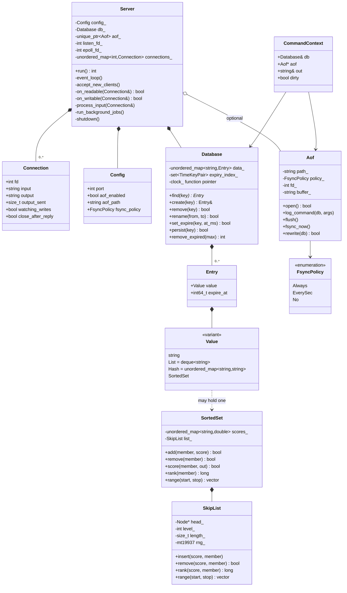
```mermaid
classDiagram
    class Server {
        -Config config_
        -Database db_
        -unique_ptr~Aof~ aof_
        -int listen_fd_
        -int epoll_fd_
        -unordered_map~int,Connection~ connections_
        +run() int
        -event_loop()
        -accept_new_clients()
        -on_readable(Connection&) bool
        -on_writable(Connection&) bool
        -process_input(Connection&)
        -run_background_jobs()
        -shutdown()
    }
    class Connection {
        +int fd
        +string input
        +string output
        +size_t output_sent
        +bool watching_writes
        +bool close_after_reply
    }
    class Config {
        +int port
        +bool aof_enabled
        +string aof_path
        +FsyncPolicy fsync_policy
    }
    class Database {
        -unordered_map~string,Entry~ data_
        -set~TimeKeyPair~ expiry_index_
        -clock_ function pointer
        +find(key) Entry*
        +create(key) Entry&
        +remove(key) bool
        +rename(from, to) bool
        +set_expire(key, at_ms) bool
        +persist(key) bool
        +remove_expired(max) int
    }
    class Entry {
        +Value value
        +int64_t expire_at
    }
    class Value {
        <<variant>>
        string
        List = deque~string~
        Hash = unordered_map~string,string~
        SortedSet
    }
    class SortedSet {
        -unordered_map~string,double~ scores_
        -SkipList list_
        +add(member, score) bool
        +remove(member) bool
        +score(member, out) bool
        +rank(member) long
        +range(start, stop) vector
    }
    class SkipList {
        -Node* head_
        -int level_
        -size_t length_
        -mt19937 rng_
        +insert(score, member)
        +remove(score, member) bool
        +rank(score, member) long
        +range(start, stop) vector
    }
    class Aof {
        -string path_
        -FsyncPolicy policy_
        -int fd_
        -string buffer_
        +open() bool
        +log_command(db, args)
        +flush()
        +fsync_now()
        +rewrite(db) bool
    }
    class FsyncPolicy {
        <<enumeration>>
        Always
        EverySec
        No
    }
    class CommandContext {
        +Database& db
        +Aof* aof
        +string& out
        +bool dirty
    }

    Server *-- Config
    Server *-- Database
    Server o-- Aof : optional
    Server *-- "0..*" Connection
    Database *-- "0..*" Entry
    Entry *-- Value
    Value ..> SortedSet : may hold one
    SortedSet *-- SkipList
    Aof --> FsyncPolicy
    CommandContext --> Database
    CommandContext --> Aof
```

- **Read it as**: filled diamond (`*--`) = "owns, lives and dies with it". Hollow diamond (`o--`) = "may or may not exist" (the AOF is a `unique_ptr` that stays empty with `--no-aof`).
- **Why it matters**: ownership is a straight tree. `Server` owns everything, so when `Server` is destroyed everything is freed in the right order with no manual cleanup. `CommandContext` only *borrows* (references and a raw pointer); it never owns.
- **Code**: `server/server.h`, `server/database.h`, `server/commands.h:13-18`.

---

## 5. What one key looks like in memory

```
unordered_map<string, Entry> data_           (node-based hash table)
 bucket array ──▶ node ──────────────────────────────────────────────────────────┐
                  │ key: std::string  "user:1"         (32 bytes + heap if long)  │
                  │ Entry                                                         │
                  │   value: std::variant<string, List, Hash, SortedSet>          │
                  │   ┌──────────────────────────────────────────────────────┐    │
                  │   │ index (which type?)  + storage big enough for the    │    │
                  │   │ LARGEST alternative = SortedSet = 5080 bytes         │    │
                  │   │   SortedSet { unordered_map scores_ (56 B)           │    │
                  │   │               SkipList { head_, level_, length_,     │    │
                  │   │                          std::mt19937 rng_ (~5000 B) }│    │
                  │   └──────────────────────────────────────────────────────┘    │
                  │   expire_at: int64_t  (-1 = no TTL)                           │
                  └───────────────────────────────────────────────────────────────┘
 sizeof(Value) = 5088 bytes, sizeof(Entry) = 5096 bytes   (measured with g++ 13, x86-64)
```

- **Read it as**: a `std::variant` is a box sized for its biggest possible content. Even when it holds a 1-byte string, the box is 5 KB because a `SortedSet` *could* live there, and `SortedSet` embeds a Mersenne Twister random number generator (`std::mt19937`, about 5 KB of state).
- **Why it matters**: this is the project's biggest hidden cost. Measured: 100 000 `SET kN v` keys use **~505 MB** RSS (about 5 KB per key). Real Redis needs around 10 MB for the same data. It is a great thing to *find and explain* in an interview. The fix and the reasoning are in the [defense guide, known issue #1](7-defense-guide.md#known-issue-1-every-key-costs-about-5-kb).
- **Code**: `server/database.h:19`, `server/skiplist.h:68`.

---

## 6. The event loop, one iteration

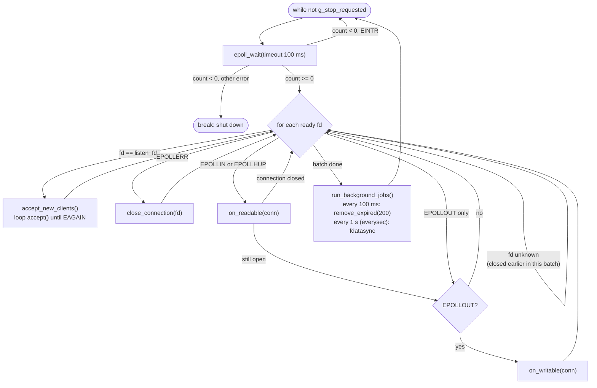
```mermaid
flowchart TD
    A(["while not g_stop_requested"]) --> B["epoll_wait(timeout 100 ms)"]
    B -->|"count < 0, EINTR"| A
    B -->|"count < 0, other error"| X(["break: shut down"])
    B -->|"count >= 0"| C{"for each ready fd"}
    C -->|"fd == listen_fd_"| D["accept_new_clients()<br/>loop accept() until EAGAIN"]
    C -->|"fd unknown<br/>(closed earlier in this batch)"| C
    C -->|"EPOLLERR"| E["close_connection(fd)"]
    C -->|"EPOLLIN or EPOLLHUP"| F["on_readable(conn)"]
    F -->|"connection closed"| C
    F -->|"still open"| G{"EPOLLOUT?"}
    C -->|"EPOLLOUT only"| G
    G -->|yes| H["on_writable(conn)"]
    G -->|no| C
    H --> C
    D --> C
    E --> C
    C -->|"batch done"| J["run_background_jobs()<br/>every 100 ms: remove_expired(200)<br/>every 1 s (everysec): fdatasync"]
    J --> A
```

- **Read it as**: the server is *one* loop. It sleeps in `epoll_wait`, handles whatever is ready, does housekeeping, and goes back to sleep.
- **Why it matters**: the 100 ms timeout means housekeeping (expiry, fsync, noticing Ctrl+C) runs even when no client sends anything. The `connections_.find(fd)` check protects against an fd closed earlier in the same batch.
- **Code**: `server/server.cpp:86-124`, `252-262`.

---

## 7. Startup sequence

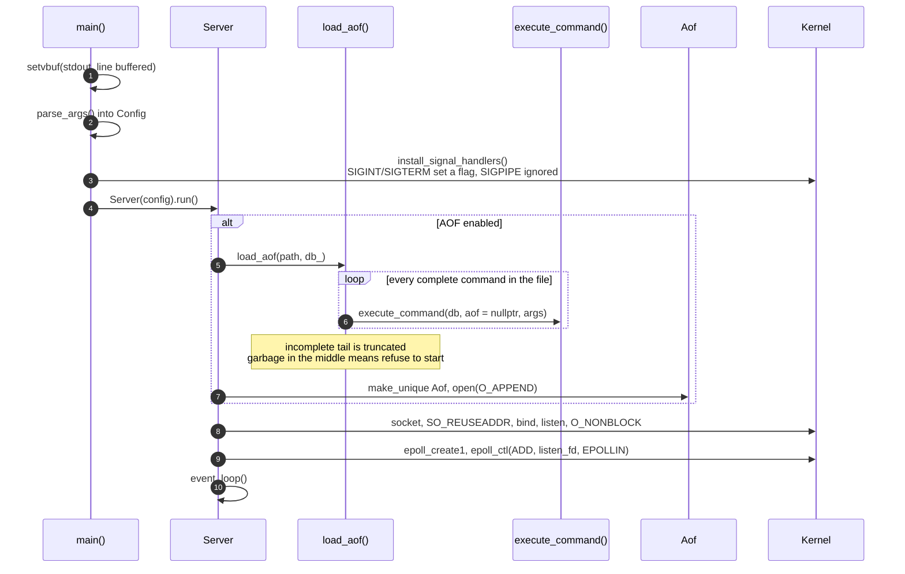
```mermaid
sequenceDiagram
    autonumber
    participant M as main()
    participant S as Server
    participant L as load_aof()
    participant E as execute_command()
    participant A as Aof
    participant K as Kernel

    M->>M: setvbuf(stdout, line buffered)
    M->>M: parse_args() into Config
    M->>K: install_signal_handlers()<br/>SIGINT/SIGTERM set a flag, SIGPIPE ignored
    M->>S: Server(config).run()
    alt AOF enabled
        S->>L: load_aof(path, db_)
        loop every complete command in the file
            L->>E: execute_command(db, aof = nullptr, args)
        end
        Note over L: incomplete tail is truncated<br/>garbage in the middle means refuse to start
        S->>A: make_unique Aof, open(O_APPEND)
    end
    S->>K: socket, SO_REUSEADDR, bind, listen, O_NONBLOCK
    S->>K: epoll_create1, epoll_ctl(ADD, listen_fd, EPOLLIN)
    S->>S: event_loop()
```

- **Why it matters**: the AOF is replayed **before** the server listens. No client can ever see a half-loaded database. Replay passes `aof = nullptr`, so replayed commands are not written to the log a second time.
- **Code**: `server/main.cpp:55-72`, `server/server.cpp:50-84`.

---

## 8. One request, end to end

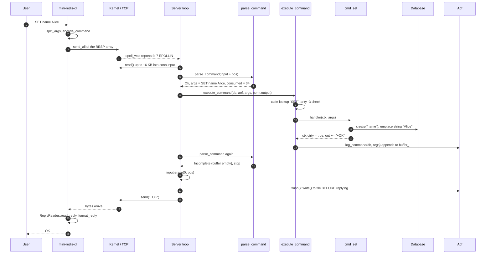
```mermaid
sequenceDiagram
    autonumber
    participant U as User
    participant C as mini-redis-cli
    participant K as Kernel / TCP
    participant L as Server loop
    participant P as parse_command
    participant X as execute_command
    participant H as cmd_set
    participant D as Database
    participant A as Aof

    U->>C: SET name Alice
    C->>C: split_args, encode_command
    C->>K: send_all of the RESP array
    K-->>L: epoll_wait reports fd 7 EPOLLIN
    L->>K: read() up to 16 KB into conn.input
    L->>P: parse_command(input + pos)
    P-->>L: Ok, args = SET name Alice, consumed = 34
    L->>X: execute_command(db, aof, args, conn.output)
    X->>X: table lookup "SET", arity -3 check
    X->>H: handler(ctx, args)
    H->>D: create("name"), emplace string "Alice"
    H-->>X: ctx.dirty = true, out += "+OK"
    X->>A: log_command(db, args) appends to buffer_
    L->>P: parse_command again
    P-->>L: Incomplete (buffer empty), stop
    L->>L: input.erase(0, pos)
    L->>A: flush(): write() to file BEFORE replying
    L->>K: send("+OK")
    K-->>C: bytes arrive
    C->>C: ReplyReader::read_reply, format_reply
    C-->>U: OK
```

- **Why it matters**: step 16 (flush) comes before step 17 (send). A client is never told `OK` for a write that is not yet in the AOF file.
- **Code**: `server/server.cpp:150-204`, `server/commands.cpp:29-51`, `server/cmd_strings.cpp:11-51`.

---

## 9. Pipelining and split packets: the input buffer over time

TCP is a byte stream. One `read()` may return half a command, exactly one, or many. Here is `conn.input` across three reads:

```
read #1 returns:  *1␍␊$4␍␊PING␍␊*1␍␊$4␍␊PING␍␊*2␍␊$4␍␊ECHO␍␊$5␍␊hel
                  └──── cmd 1 ────┘└──── cmd 2 ────┘└──── cmd 3 (incomplete) ──┘
  parse: Ok (14 bytes) -> PONG,  Ok (14 bytes) -> PONG,  Incomplete -> stop
  erase(0, 28)      conn.input = "*2␍␊$4␍␊ECHO␍␊$5␍␊hel"
  flush AOF once, send "+PONG␍␊+PONG␍␊" in ONE send()

read #2 returns:  lo␍␊
  conn.input = "*2␍␊$4␍␊ECHO␍␊$5␍␊hello␍␊"
  parse from the START of cmd 3 again: Ok -> "$5␍␊hello␍␊"
  erase(0, 25)      conn.input = ""
```

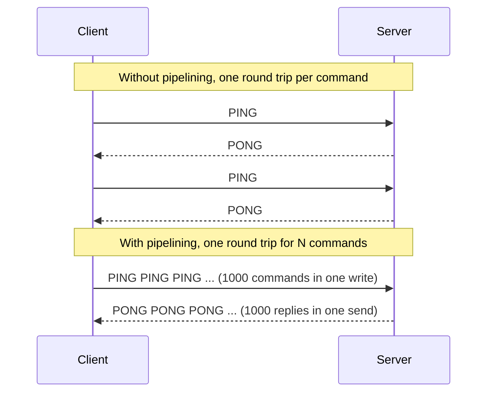
```mermaid
sequenceDiagram
    participant C as Client
    participant S as Server
    Note over C,S: Without pipelining, one round trip per command
    C->>S: PING
    S-->>C: PONG
    C->>S: PING
    S-->>C: PONG
    Note over C,S: With pipelining, one round trip for N commands
    C->>S: PING PING PING ... (1000 commands in one write)
    S-->>C: PONG PONG PONG ... (1000 replies in one send)
```

- **Why it matters**: the parser never keeps state between calls. On `Incomplete` it consumes nothing, and the next call starts again from the beginning of that command. That is simple and still cheap, because bulk bodies are skipped using their length, never scanned.
- **Code**: `server/server.cpp:182-204`. Tests: `every_partial_prefix_is_incomplete`, `parses_pipelined_commands_one_at_a_time`; e2e "pipelining" and "split across two TCP packets".

---

## 10. Parser decision flow

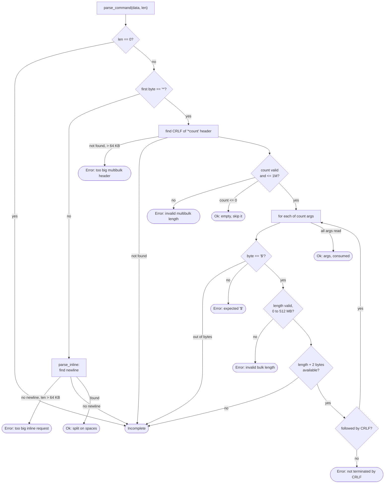
```mermaid
flowchart TD
    A["parse_command(data, len)"] --> B{"len == 0?"}
    B -->|yes| INC(["Incomplete"])
    B -->|no| C{"first byte == '*'?"}
    C -->|no| I["parse_inline:<br/>find newline"]
    I -->|"no newline, len > 64 KB"| ERR(["Error: too big inline request"])
    I -->|"no newline"| INC
    I -->|"found"| IOK(["Ok: split on spaces"])
    C -->|yes| H["find CRLF of '*count' header"]
    H -->|"not found, > 64 KB"| ERR2(["Error: too big multibulk header"])
    H -->|"not found"| INC
    H --> N{"count valid<br/>and <= 1M?"}
    N -->|no| ERR3(["Error: invalid multibulk length"])
    N -->|"count <= 0"| EMPTY(["Ok: empty, skip it"])
    N -->|yes| LOOP["for each of count args"]
    LOOP --> D{"byte == '$'?"}
    D -->|"out of bytes"| INC
    D -->|no| ERR4(["Error: expected '$'"])
    D -->|yes| BL{"length valid,<br/>0 to 512 MB?"}
    BL -->|no| ERR5(["Error: invalid bulk length"])
    BL --> BODY{"length + 2 bytes<br/>available?"}
    BODY -->|no| INC
    BODY -->|yes| T{"followed by CRLF?"}
    T -->|no| ERR6(["Error: not terminated by CRLF"])
    T -->|yes| LOOP
    LOOP -->|"all args read"| OK(["Ok: args, consumed"])
```

- **Read it as**: three possible outcomes. `Ok` (run it), `Incomplete` (wait for more bytes), `Error` (reply `-ERR Protocol error` and close the connection).
- **Why it matters**: every limit (64 KB header, 1M arguments, 512 MB per argument) exists so a malicious client cannot make the server allocate unbounded memory. These are the same limits real Redis uses.
- **Code**: `server/resp_parser.cpp`. Test: `rejects_malformed_input`.

---

## 11. Command dispatch

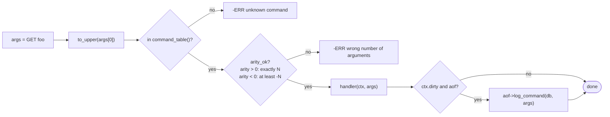
```mermaid
flowchart LR
    A["args = GET foo"] --> B["to_upper(args[0])"]
    B --> C{"in command_table()?"}
    C -->|no| E1["-ERR unknown command"]
    C -->|yes| D{"arity_ok?<br/>arity > 0: exactly N<br/>arity < 0: at least -N"}
    D -->|no| E2["-ERR wrong number of arguments"]
    D -->|yes| F["handler(ctx, args)"]
    F --> G{"ctx.dirty and aof?"}
    G -->|yes| H["aof->log_command(db, args)"]
    G -->|no| Z(["done"])
    H --> Z
```

The table is built once (a function-local `static` initialised by a lambda) from five registration functions:

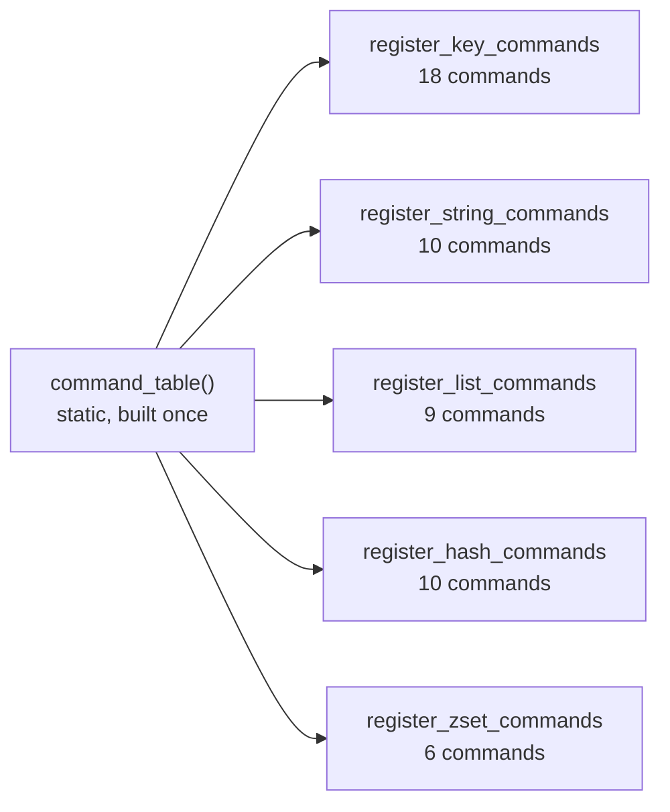
```mermaid
flowchart LR
    T["command_table()<br/>static, built once"] --> K["register_key_commands<br/>18 commands"]
    T --> S["register_string_commands<br/>10 commands"]
    T --> L["register_list_commands<br/>9 commands"]
    T --> H["register_hash_commands<br/>10 commands"]
    T --> Z["register_zset_commands<br/>6 commands"]
```

- **Why it matters**: arity is checked in one place, so no handler can read past the end of `args`. Only commands that *actually changed something* are logged (`DEL missing-key` sets no dirty flag). That keeps the AOF minimal and replay exact.
- **Code**: `server/commands.cpp`. Test: `errors_for_unknown_commands_and_bad_arity`, `aof_replay_restores_all_types` (checks that `GET` and `DEL missing` are not logged).

---

## 12. Connection lifecycle (state machine)

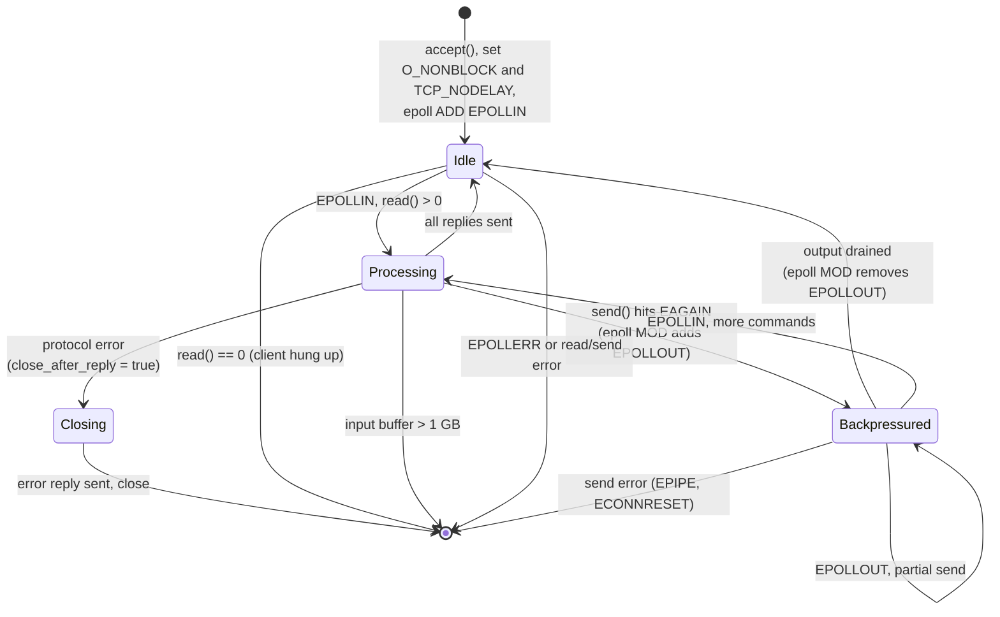
```mermaid
stateDiagram-v2
    [*] --> Idle: accept(), set O_NONBLOCK and TCP_NODELAY,<br/>epoll ADD EPOLLIN
    Idle --> Processing: EPOLLIN, read() > 0
    Processing --> Idle: all replies sent
    Processing --> Backpressured: send() hits EAGAIN<br/>(epoll MOD adds EPOLLOUT)
    Backpressured --> Backpressured: EPOLLOUT, partial send
    Backpressured --> Idle: output drained<br/>(epoll MOD removes EPOLLOUT)
    Backpressured --> Processing: EPOLLIN, more commands
    Processing --> Closing: protocol error<br/>(close_after_reply = true)
    Closing --> [*]: error reply sent, close
    Idle --> [*]: read() == 0 (client hung up)
    Processing --> [*]: input buffer > 1 GB
    Idle --> [*]: EPOLLERR or read/send error
    Backpressured --> [*]: send error (EPIPE, ECONNRESET)
```

- **Why it matters**: every way a connection can end goes through `close_connection()`, which does three things in order: remove from epoll, `close(fd)`, erase the `Connection`. The handlers return `false` after closing so the caller never touches the freed `Connection` again.
- **Code**: `server/server.cpp:126-250`, `server/connection.h`.

---

## 13. Slow reader: EPOLLOUT on and off

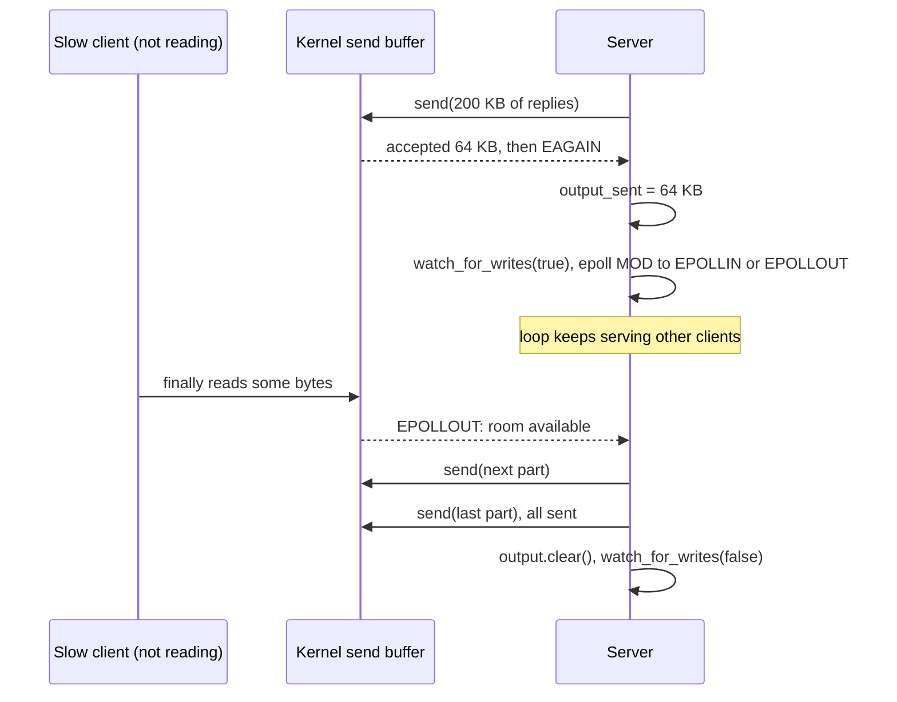
```mermaid
sequenceDiagram
    participant C as Slow client (not reading)
    participant K as Kernel send buffer
    participant S as Server
    S->>K: send(200 KB of replies)
    K-->>S: accepted 64 KB, then EAGAIN
    S->>S: output_sent = 64 KB
    S->>S: watch_for_writes(true), epoll MOD to EPOLLIN or EPOLLOUT
    Note over S: loop keeps serving other clients
    C->>K: finally reads some bytes
    K-->>S: EPOLLOUT: room available
    S->>K: send(next part)
    S->>K: send(last part), all sent
    S->>S: output.clear(), watch_for_writes(false)
```

- **Why it matters**: a socket is writable almost all the time. If `EPOLLOUT` stayed on, level-triggered epoll would wake the loop constantly with nothing to do, burning 100% CPU. So it is enabled only while there is unsent data.
- **Known gap**: `conn.output` has no size limit. A client that sends commands but never reads replies makes it grow forever. Real Redis disconnects it (`client-output-buffer-limit`). See the [defense guide](7-defense-guide.md#known-issue-2-output-buffers-are-unbounded).
- **Code**: `server/server.cpp:206-244`.

---

## 14. Key lifecycle and expiry

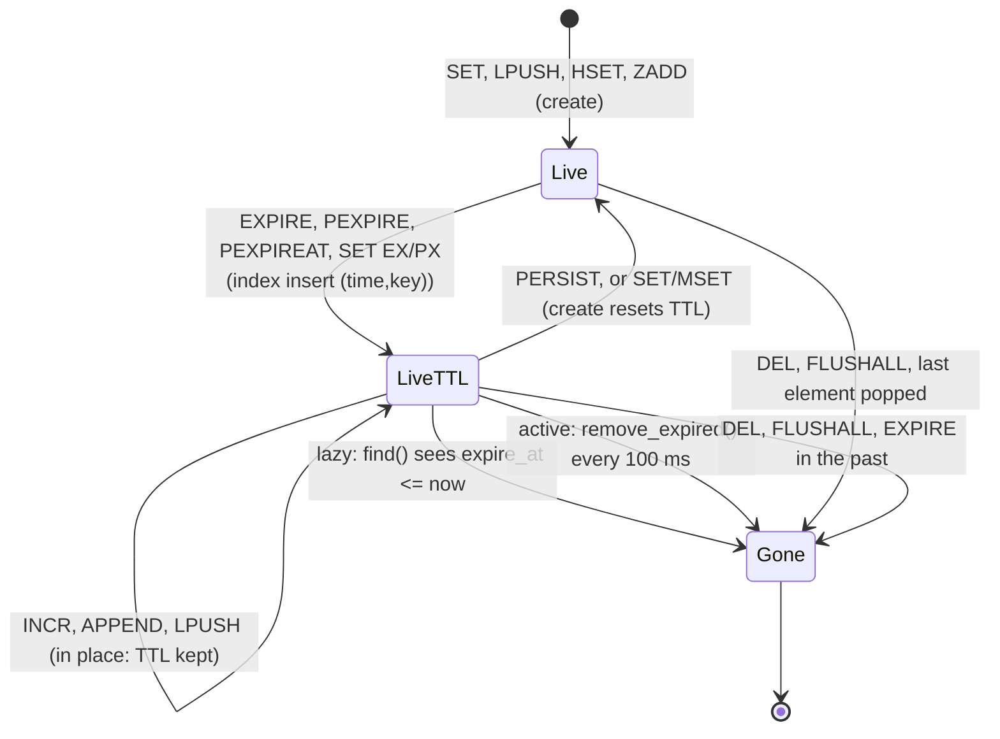
```mermaid
stateDiagram-v2
    [*] --> Live: SET, LPUSH, HSET, ZADD (create)
    Live --> LiveTTL: EXPIRE, PEXPIRE, PEXPIREAT, SET EX/PX<br/>(index insert (time,key))
    LiveTTL --> Live: PERSIST, or SET/MSET (create resets TTL)
    LiveTTL --> LiveTTL: INCR, APPEND, LPUSH (in place: TTL kept)
    LiveTTL --> Gone: lazy: find() sees expire_at <= now
    LiveTTL --> Gone: active: remove_expired() every 100 ms
    Live --> Gone: DEL, FLUSHALL, last element popped
    LiveTTL --> Gone: DEL, FLUSHALL, EXPIRE in the past
    Gone --> [*]
```

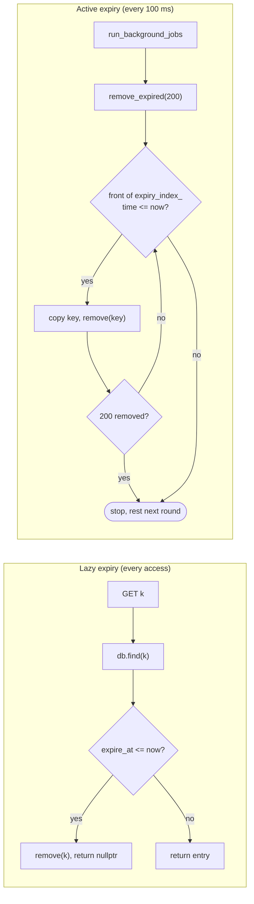
```mermaid
flowchart LR
    subgraph Lazy["Lazy expiry (every access)"]
        G["GET k"] --> F["db.find(k)"]
        F --> X{"expire_at <= now?"}
        X -->|yes| R["remove(k), return nullptr"]
        X -->|no| V["return entry"]
    end
    subgraph Active["Active expiry (every 100 ms)"]
        T["run_background_jobs"] --> RE["remove_expired(200)"]
        RE --> FR{"front of expiry_index_<br/>time <= now?"}
        FR -->|yes| DEL["copy key, remove(key)"] --> CNT{"200 removed?"}
        CNT -->|no| FR
        CNT -->|yes| STOP(["stop, rest next round"])
        FR -->|no| STOP
    end
```

- **Why it matters**: lazy expiry guarantees that no command ever *sees* an expired key. Active expiry guarantees that keys nobody touches still free their memory. Because `expiry_index_` is sorted by time, the work is proportional to the keys that *actually expired*, not to the total number of keys. The cap of 200 per round keeps the loop responsive even if a million keys expire at once.
- **Code**: `server/database.cpp:18-30`, `88-100`. Tests: `lazy_expiry_hides_and_deletes_keys`, `active_expiry_removes_untouched_keys`, `create_clears_old_ttl`.

---

## 15. AOF write path and fsync timing

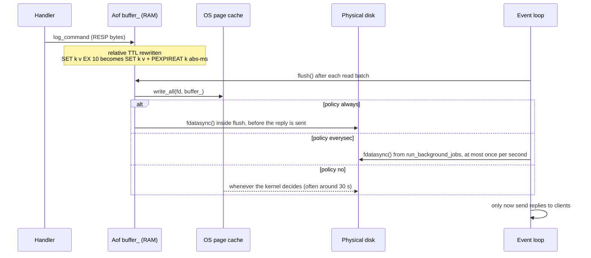
```mermaid
sequenceDiagram
    participant H as Handler
    participant A as Aof buffer_ (RAM)
    participant PC as OS page cache
    participant D as Physical disk
    participant L as Event loop

    H->>A: log_command (RESP bytes)
    Note over A: relative TTL rewritten<br/>SET k v EX 10 becomes SET k v + PEXPIREAT k abs-ms
    L->>A: flush() after each read batch
    A->>PC: write_all(fd, buffer_)
    alt policy always
        A->>D: fdatasync() inside flush, before the reply is sent
    else policy everysec
        L->>D: fdatasync() from run_background_jobs, at most once per second
    else policy no
        PC-->>D: whenever the kernel decides (often around 30 s)
    end
    L->>L: only now send replies to clients
```

| What fails | `always` | `everysec` | `no` |
|---|---|---|---|
| The **process** crashes (bug, `kill -9`) | nothing lost | nothing lost | nothing lost |
| The **machine** loses power | about nothing | up to ~1 s of writes | up to ~30 s of writes |
| Cost per write batch | one disk sync (milliseconds) | none on the hot path | none |

- **Why it matters**: `write()` only copies into the kernel's page cache. The data survives a process crash but not a power cut. Only `fsync`/`fdatasync` reaches the disk. The three policies are the classic durability vs speed trade-off, with the same names Redis uses.
- **Code**: `server/aof.cpp:83-119`, `server/server.cpp:175-177`, `258-261`.

---

## 16. AOF replay at startup

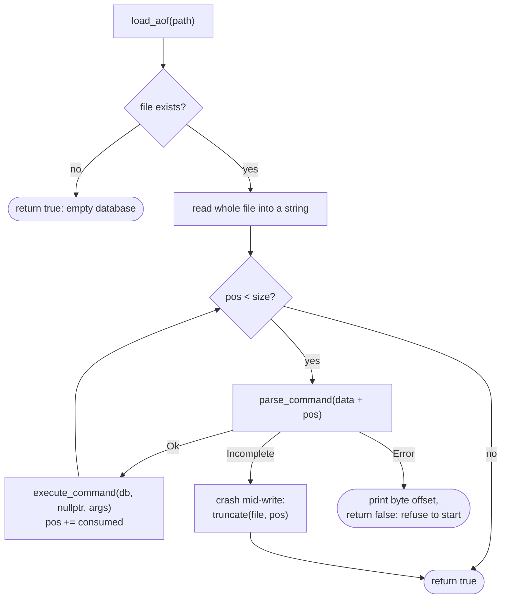
```mermaid
flowchart TD
    A["load_aof(path)"] --> B{"file exists?"}
    B -->|no| OK0(["return true: empty database"])
    B -->|yes| C["read whole file into a string"]
    C --> D{"pos < size?"}
    D -->|no| OK(["return true"])
    D -->|yes| E["parse_command(data + pos)"]
    E -->|Ok| F["execute_command(db, nullptr, args)<br/>pos += consumed"] --> D
    E -->|Incomplete| G["crash mid-write:<br/>truncate(file, pos)"] --> OK
    E -->|Error| H(["print byte offset,<br/>return false: refuse to start"])
```

- **Why it matters**: two kinds of damage get two different answers. A cut-off *tail* is the normal result of a crash in the middle of `write()`. It is safe to drop, because that command was never acknowledged to the client (the AOF is written before replies). Garbage in the *middle* means real corruption. Starting anyway would silently lose data, so the server stops and tells you the byte offset.
- **Code**: `server/aof.cpp:152-191`. Tests: `aof_truncated_tail_is_repaired`, `aof_corrupt_file_is_rejected`.

---

## 17. REWRITEAOF: atomic compaction

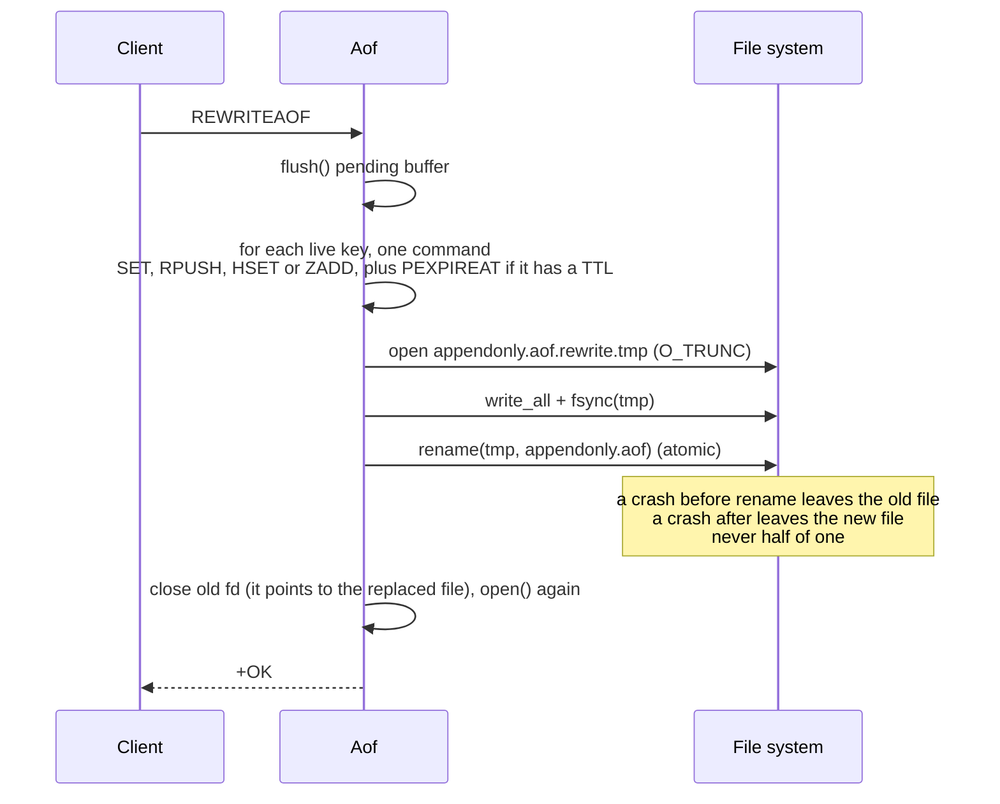
```mermaid
sequenceDiagram
    participant C as Client
    participant A as Aof
    participant FS as File system
    C->>A: REWRITEAOF
    A->>A: flush() pending buffer
    A->>A: for each live key, one command<br/>SET, RPUSH, HSET or ZADD, plus PEXPIREAT if it has a TTL
    A->>FS: open appendonly.aof.rewrite.tmp (O_TRUNC)
    A->>FS: write_all + fsync(tmp)
    A->>FS: rename(tmp, appendonly.aof)  (atomic)
    Note over FS: a crash before rename leaves the old file<br/>a crash after leaves the new file<br/>never half of one
    A->>A: close old fd (it points to the replaced file), open() again
    A-->>C: +OK
```

- **Why it matters**: `INCR counter` run 200 times is 200 log entries but one value. After the rewrite it is one `SET`. The test checks that the file shrinks to under a tenth of its size.
- **Known gap**: the rewrite runs on the event loop thread, so the server pauses while it writes. Real Redis `fork()`s a child process for this.
- **Code**: `server/aof.cpp:121-150`. Test: `aof_rewrite_compacts_the_file`.

---

## 18. Graceful shutdown

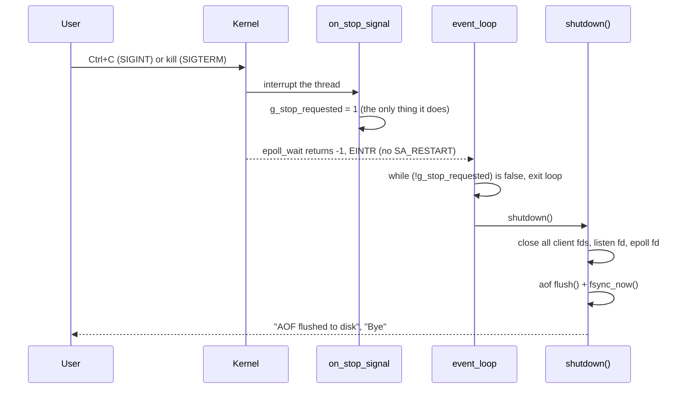
```mermaid
sequenceDiagram
    participant U as User
    participant K as Kernel
    participant H as on_stop_signal
    participant L as event_loop
    participant S as shutdown()
    U->>K: Ctrl+C (SIGINT) or kill (SIGTERM)
    K->>H: interrupt the thread
    H->>H: g_stop_requested = 1 (the only thing it does)
    K-->>L: epoll_wait returns -1, EINTR (no SA_RESTART)
    L->>L: while (!g_stop_requested) is false, exit loop
    L->>S: shutdown()
    S->>S: close all client fds, listen fd, epoll fd
    S->>S: aof flush() + fsync_now()
    S-->>U: "AOF flushed to disk", "Bye"
```

- **Why it matters**: a signal handler can interrupt the program at *any* instruction, even inside `malloc`. Calling `printf` or `exit()` from it can deadlock or corrupt state. Setting a `volatile sig_atomic_t` flag is the textbook-safe pattern.
- **Code**: `server/server.cpp:16-42`, `264-279`.

---

## 19. Skip list with spans: a worked example

Members `a..e` with scores 1..5. Each link is written `──(span)──▶`. A span is how many level-0 steps the link jumps over.

```
level 2: HEAD ─────────────(3)────────────▶ c ───────────(2)──────────▶ nil
level 1: HEAD ───(1)──▶ a ───(2)─────────▶ c ───(1)──▶ d ───(1)─────▶ nil
level 0: HEAD ─(1)─▶ a ─(1)─▶ b ─(1)─▶ c ─(1)─▶ d ─(1)─▶ e ─────────▶ nil
rank (1-based):      1        2        3        4        5
```

**ZRANK of `d`** (`rank()` adds up the spans along the search path):

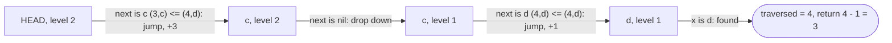
```mermaid
flowchart LR
    H2["HEAD, level 2"] -- "next is c (3,c) <= (4,d): jump, +3" --> C2["c, level 2"]
    C2 -- "next is nil: drop down" --> C1["c, level 1"]
    C1 -- "next is d (4,d) <= (4,d): jump, +1" --> D1["d, level 1"]
    D1 -- "x is d: found" --> R(["traversed = 4, return 4 - 1 = 3"])
```

Only 2 jumps instead of walking 4 nodes. With *n* members, the expected number of steps is O(log n).

**Inserting `b2` with score 2.5 and random height 2** (span maintenance in `insert`):

```
before   level 1: a ──(2)──▶ c          level 0: b ──(1)──▶ c
after    level 1: a ──(2)──▶ b2 ──(1)──▶ c
         level 0: b ──(1)──▶ b2 ──(1)──▶ c
         level 2: HEAD ──(3+1 = 4)──▶ c        (passes over b2, so +1)
```

- **Why it matters**: a balanced tree (`std::set`) can find an element in O(log n) but cannot tell you its *position* without walking. The spans make rank and "jump to position k" O(log n). Measured: 200 `ZRANK` on 200 000 members took about 0.3 to 0.9 ms, against 2 to 4 seconds for walking a `std::set` (thousands of times faster).
- **Code**: `server/skiplist.cpp`. Full derivation in [walkthrough 03](3-walkthrough/03-skiplist.md).

---

## 20. Sorted set = hash map + skip list

```mermaid
flowchart LR
    subgraph SortedSet
        HM["scores_: unordered_map<br/>alice: 100<br/>bob: 200<br/>carol: 300"]
        SL["list_: SkipList<br/>(100, alice) to (200, bob) to (300, carol)"]
    end
    ZS["ZSCORE bob"] -->|"O(1)"| HM
    ZR["ZRANK bob"] -->|"1. score lookup O(1)"| HM
    ZR -->|"2. rank(200, bob) O(log n)"| SL
    ZG["ZRANGE 0 1"] -->|"jump to rank, walk level 0"| SL
    ZA["ZADD 50 bob"] -->|"old score"| HM
    ZA -->|"remove(200,bob), insert(50,bob)"| SL
```

| Operation | Hash map | Skip list | Total |
|---|---|---|---|
| `ZSCORE` | O(1) | not used | **O(1)** |
| `ZADD` (new member) | O(1) | O(log n) | **O(log n)** |
| `ZADD` (new score) | O(1) | remove + insert O(log n) | **O(log n)** |
| `ZREM` | O(1) | O(log n) | **O(log n)** |
| `ZRANK` | O(1) | O(log n) | **O(log n)** |
| `ZRANGE start stop` | not used | O(log n + m) | **O(log n + m)** |

- **Why it matters**: the skip list is sorted by `(score, member)`, so to find a member you need its score first. The hash map provides that in O(1). This invariant (both structures always hold the same members) is checked by the randomized model test after 20 000 operations.
- **Code**: `server/sorted_set.cpp`. Test: `sorted_set_matches_reference_model`.

---

## 21. Client architecture

```mermaid
flowchart TD
    A["main(argc, argv)"] --> B["parse -h, -p<br/>rest = command"]
    B --> C["TcpConnection::connect_to<br/>getaddrinfo, try each address"]
    C --> D{"command given?"}
    D -->|yes| E["run_command once"] --> F(["exit 0, or 1 on error reply"])
    D -->|no| G{"isatty(stdin)?"}
    G -->|yes| P["show prompt"]
    G -->|no| Q["no prompt (piped input)"]
    P --> R["getline"]
    Q --> R
    R -->|EOF| Z(["exit 0"])
    R --> S["split_args (quotes, escapes)"]
    S -->|"quit, exit"| Z
    S -->|help| R
    S --> T["run_command"]
    T --> U["encode_command"] --> V["send_all"] --> W["ReplyReader::read_reply<br/>(16 KB buffered, recursive for arrays)"] --> X["format_reply<br/>(redis-cli style)"] --> R
```

- **Why it matters**: the client is deliberately *blocking*. It does one thing at a time, so an event loop would add complexity for no gain. The buffered `ReplyReader` does one `recv()` per 16 KB instead of one per byte.
- **Code**: `client/`. Walkthrough: [07-client.md](3-walkthrough/07-client.md).

---

## 22. Build graph

```mermaid
flowchart LR
    subgraph Sources
        CORE["server/*.cpp<br/>except main.cpp<br/>(CORE_OBJS)"]
        SMAIN["server/main.cpp"]
        CL["client/*.cpp"]
        TS["tests/*.cpp"]
        BM["bench/micro_bench.cpp"]
    end
    CORE --> SRV["bin/mini-redis-server"]
    SMAIN --> SRV
    CL --> CLI["bin/mini-redis-cli"]
    CORE --> UT["bin/unit-tests"]
    TS --> UT
    CORE --> MB["bin/micro-bench"]
    BM --> MB
    SRV --> E2E["make e2e-test<br/>tests/e2e_test.sh"]
    CLI --> E2E
    UT --> MT["make unit-test"]
    MT --> TEST["make test"]
    E2E --> TEST
    TEST --> CI["GitHub Actions<br/>SAN=0 and SAN=1"]
```

- **Why it matters**: the server logic is compiled once into `CORE_OBJS` and linked into three programs: the server, the unit tests and the benchmarks. The tests exercise the *exact* code that ships, not a copy. `SAN=1` builds to a separate `build/san` directory so the two configurations never mix object files.
- **Code**: `Makefile`, `.github/workflows/ci.yml`.

---

## 23. Test map

```mermaid
flowchart TB
    subgraph E2E["End-to-end: tests/e2e_test.sh (real binaries over TCP)"]
        e1["basic commands via the CLI"]
        e2["pipelining 1000 PINGs"]
        e3["split TCP packet"]
        e4["inline command"]
        e5["protocol error closes"]
        e6["20 clients x 25 INCR = 500"]
        e7["restart recovers data and TTL"]
        e8["REWRITEAOF shrinks the file"]
        e9["official redis-cli"]
    end
    subgraph UNIT["Unit tests: 31 TESTs (no network)"]
        u1["test_resp_parser: 7"]
        u2["test_database: 6"]
        u3["test_sorted_set: 3 (incl. 20k random ops vs std::set)"]
        u4["test_commands: 10"]
        u5["test_aof: 5"]
    end
    subgraph SAN["Every test again under ASan + UBSan in CI"]
        s1["use-after-free, buffer overflow,<br/>leaks, signed overflow"]
    end
    UNIT --> E2E --> SAN
```

- **Why it matters**: each layer is tested at its own level. The parser is tested on raw bytes, the database on a fake clock, commands without sockets, and the whole system through real TCP. The sanitizers turn silent memory bugs into loud test failures.
- **Code**: `tests/`, [walkthrough 08](3-walkthrough/08-tests-and-build.md).

---

Next: [Layer 6: C++ concepts, in plain language](6-cpp-concepts.md)
